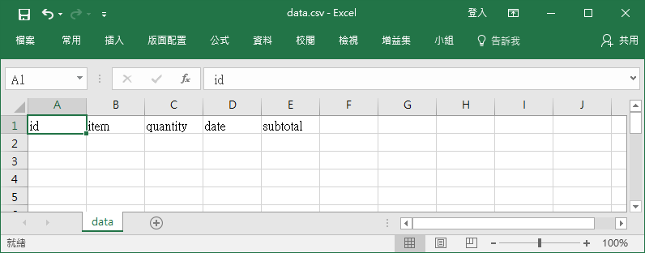

==============
從珍珠奶茶開始
==============

如果我們抬起頭來看看街上的飲料店，會發現這是一個很了不起的成就，因為不但選擇多樣而且價格實惠，但是如果我們要進一步發展，就會遇到很多瓶頸，主要原因當然是原料取得不易，和人工越來越昂貴所導致。因為我們必須要趕上其他行業的發展，也必須要理解世界上沒有永遠的隔閡距離，因此如果我們不願意進步，很快就會遇到真實的挑戰。

要發展首先從內部做起，如果我們要製作一個簡單的銷售程式，也就是記錄總共賣了幾杯珍珠奶茶，方式有很多種，但是眼前這一種可以幫助我們從遠端連線觀察銷售情況，也可以往手機發展，甚至可以轉變成公開的訂購網站，可以說是相當好的出發點，不如我們現在就開始製作飲料店的管銷程式。

程式即是可執行的網站
====================

網路核心（.Net Core）的一個最大特點就是它自己就是一個完整的程式，同時也是一個網路服務功能導向的工具，我們可以輕鬆的建立完整的網站而不需要再藉助其他的網站伺服器，尤其是當我們想要使用家裡的舊電腦來做這個管理站時，更是可以輕鬆將做好的軟體複製到任何一台電腦上，就可以馬上執行變成工作站。我們必須要知道，任何一個軟體最困難的不是開發，而是維護工作，如果這個軟體仰賴太多外在的結構才能運作，我們的維護工作就會日益困難，相反的，在使用網路核心開發的軟體或網站，它自己就可以是單獨存在的狀態，當然對於我們來說就是相當好的條件。

傳統的網站，不論靜態或是動態，除了準備好網頁的部分之外，還需要電腦安裝網站伺服器，常見的有阿帕契（Apache）、網際網路資訊服務器（IIS）和引擎 X（nginx），以前自己架設網站時處理好這個伺服器系統就是一大問題，然而，網路核心就自己準備好了一個伺服器系統，叫做紅隼（Kestrel）伺服器，當我們自己內部使用時，第一選擇就是這個快速方便的紅隼伺服器。

如果我們要將網站放在遠端的伺服器電腦上，那大多數都要有更完整的伺服器程式才可以使用，那個就不是本指引會探討的內容，相對也是比較複雜的技術，需要更多的經驗和幫忙才能完成。

管理檔案的建立
==============

程式設計並不會完全取代我們原先具備的好用軟體，我們也不應該期待在短時間內就可以完全自己製造全部需要的東西，不是嗎？最好的辦法是兩者兼具，用原本好用的軟體做原本就做得很好的事情，用程式設計來加強所需要的功能，和預防嚴重失誤的情況，是最常見的兩大好處。首先，我們要用試算表（Excel）來設計所需要的管銷清單，如果原先就有其他的試算表檔案最好不要直接拿來使用，才不會造成自己的麻煩，譬如誤刪或設計困難，而是重新製作一個簡單的檔案來方便後續的處理。

首先在試算表中輸入代表編號、項目、數量、時間、小計的英文（id, item, quantity, date, subtotal），然後存成逗號分隔的檔案（.csv），當作我們的資料庫儲存格式，如圖 1。

   圖 1: 資料庫檔案設計

如果沒有試算表程式，也可以打開筆記本軟體，直接在第一行輸入沒有任何空格在內的 ``id,item,quantity,date,subtotal``\ ，存成 ``data.csv``\ ，編碼記得選擇 UTF-8。或者直接從這裡\ `下載檔案 <_static/data.csv>`__\ 也是一樣的。

目前如果只是在內部使用，不會有很多人同時連上我們的程式時，這樣子的格式檔案就是相當好用的選擇，但是要開發成中大型軟體時，這樣子的格式就會有連線上的問題了，不過，我們就以這個來前進就行了。

之所以要使用英文代號當作每欄的標題名稱是因為程式設計的方便性以及減少錯誤的可能，未來要使用大型資料庫軟體時，也會比較容易轉換，所以建議使用簡單的英文來操作這個設定。

也要記得這個試算表的檔名只是\ ``data``\ 而已，但是作為安全的第一課，資料庫檔案是最重要的資料，如果我們放在網站上是如此簡單的檔案名稱時，很有可能隨便的人都可以輕鬆在網址上測試輸入而獲取整個檔案，不過這不是眼前最重要的問題，只是要知道在學習的剛開始，我們不用著急，但這個並不是安全的作法。

程式設計的根基：類別
====================

如果說物理的最小粒子是分子的話，那程式設計的分子就是類別。當我們從剛剛的試算表出發時，馬上就要知道程式設計的第一步就是建立一個代表剛剛試算表中的每一列資料的元件，也就是要用程式來存取資料時，我們必須要使用的工具就是一個類別。

在網路核心中，類別的建立很容易，我們開啟一個筆記本檔案，在裡面輸入以下幾行字：

.. raw:: html

   
