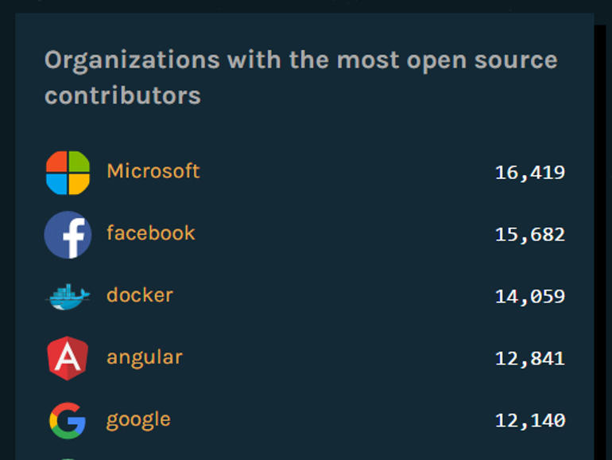

入門指引
========

從網路發展開始，線上購物一直都是熱門技術，早在西元1994年首批在網路上販售東西的店家就有必勝客，那個時候人們就已經可以直接網購匹薩。過了二十多年的今天，技術不斷進步，寫網頁不再是困難的事情，但是要如何操作與選擇，反倒是現今世代的難題。

   圖1：PizzaHut最早線上訂購的圖示

隨便到書店走一遭，琳瑯滿目的是各式各樣不同的主題方法，不論是從
PHP、JAVA、Python、Perl，非常多種技術都可以幫助使用者達到架設線上訂購網站的目標，但是真的可以兼顧不斷更新內容和維護網站架構的方法卻是相對少見，或者當使用者想要擴充手機平板的訂購功能，甚至設計相對應的手機應用程式
App 時，就不是任何技術都可以無縫接軌、學一個打十個，方便延伸的好技術了。

好的技術需要強大的支援，好的人力也需要有充足的休息，隨便找一個技術去學習，只會浪費時間與精力，好比隨便找一個工作賺錢，只會累壞自己。重點是要懂得利用手邊的資源去操作有力的工具，幫助自己達到想要的目標。現在的電腦正是被大家給忽視的強大工具，只要學習少量的技術，就可以把電腦從上網聽音樂的家具變成現成的機器人，何樂而不為呢？

為什麼是網路核心？
------------------

很多人討厭微軟的強大與壟斷，所以喜歡採用其他免費的技術來達成相同的功能，或者轉而使用更昂貴的蘋果產品，但是當今天我們從簡單的使用者變成開發者的時候，還要考慮更多的困難與議題，譬如：

-  相關文件的完整度
-  線上資源的獲取方法
-  相關格式的接納度
-  開發工具的支援

雖然微軟有相當多的問題，產品也不總是最合理最開放，然而近一年來的確有相當大的改善，包括在2016年開放原始碼網站
GitHub
上被評比為第一名，或是在熱門技術的社群互動上，都可以看見全新的策略方針與努力付出。而目前我們要採用的技術，網路核心（.Net
Core）便是一個最佳的例子。

   圖2：微軟在 GitHub 上名列組織貢獻度排名第一

早從西元2000年開始便出現的動態網頁技術「動態伺服器網頁（ASP）」一直都是網路上熱門的架站技術，經過
ASP 後繼者 Asp.Net
一代到四代的歷練，十多年的發展時間，微軟於西元2016年六月正式推出最新的完整技術不再叫做
Asp.Net
第五代，而是採用全新名稱「網路核心」第一代，有著下面三個關鍵要素：

1. 跨平台：不論開發者用 Windows、macOS 或 Linux，使用者在
   PC、Mac、Linux、手機以及平板，都可以使用這個架構平台來開發軟體給在各種平台上的使用者來使用。
2. 全新架構：開發者寫完程式碼後所產生的應用程式可以在原有的「網際網路資訊服務器（IIS）」上運行，也可以單獨以完整封裝程式來執行。編譯網頁程式時不但可以在完整強大的開發軟體
   Visual Studio 2015
   上製作，也可以在多種命令列中操作，對於開發者來說不但可以按照自己習慣選擇，也可以加快開發速度。
3. 開放原始碼：這套平台架構從上游到下游全部開放原始碼，對於開發者來說，也就是將整套工具全部都免費放送的意思，而且也被微軟視為重點計畫來推廣發展至少十年以上，不用擔心之後會沒有協助或更新。

最重要的是，由於採用模組化的安排，只將所需要的元件放在程式中，並加上開發群和社群的共同努力，在相同的硬體上，測試出來的速度是
Node.js 的八倍快，是 Go
的三倍快。所以，對於身為開發者的我們，是目前最好的選擇。

目標是什麼？
------------

在網路科技日益成熟的今天，過去沒有學習過相關技術的人不再需要從頭學起，只要有一台電腦和本篇指引，在短時間內就可以架設出自己的線上早餐店，不論是要從這個早餐店延伸服務到各行各業，或是深入技術到手機平板應用軟體，都會是相當容易的發展。

本指引的預設讀者是完全沒有任何程式設計的基礎，沒有網頁開發的技術經驗，然而如果有簡單網頁開發能力，會是更加容易入手的進階課程，可以使網頁從靜態提供資訊，變成動態接收使用者的回饋或訂單。需要寫程式的地方不少，但是好比學一個做菜，其實只是看起來很難，實際上一回生二回熟，最重要的是，按照指引的步驟操作，每一步邊看邊照做，不會比做一個漢堡還要困難的。

採用的技術也是業界相當成熟的程式語言
C#，不過，因為網路上已經有很多相關課程教學，所以我們在文章中只會簡單的提到相關語法，幫助讀者理解語意為目標，不會深入探討程式語言的技術。如果你願意，可以先找相關簡介文章理解什麼是
C#，以及它的簡單語法。本指引將著重在網頁技術的解釋，如果你放輕鬆跟著我們前進，不用害怕程式設計，也可以逐步學會
C# 的語法。
